# DX11 Math & Shader Demo

게임수학·셰이더 프로그래밍의 핵심 개념을 **하나의 Direct3D 11 인터랙티브 데모**로 보여주는 교육용 프로젝트입니다. 숫자키로 씬을 전환하고, 각 씬 안에서 `Q/W/E/R` 등으로 세부 개념을 토글하며 실시간으로 확인할 수 있습니다.

- **환경**: Windows 10/11, Visual Studio 2022 (v143)
- **플랫폼**: Win32 Desktop, x64, Direct3D 11
- **의존성**: **Windows SDK만 사용** (vcpkg/NuGet/외부 라이브러리 불필요) — clone 후 바로 빌드됩니다.

> 작성 중인 프로젝트입니다. 현재 **Scene01~04** (게임수학 기초 · 보간/곡선 · 행렬/투영 · Phong/Normal Mapping) 가 구현되어 있고, **Scene05~08** 은 같은 씬 시스템 위에 순차적으로 추가됩니다. 전체 명세는 [`docs/dx11-math-shader-demo-guide.md`](docs/dx11-math-shader-demo-guide.md) 참고.

---

## 빌드 & 실행

```text
1. DX11MathShader.sln 을 Visual Studio 2022로 연다
2. 구성: Debug 또는 Release / 플랫폼: x64
3. 빌드 후 실행 (F5)
```

명령줄 빌드:

```powershell
msbuild DX11MathShader.sln /p:Configuration=Release /p:Platform=x64
# 결과물: bin\x64\Release\DX11MathShader.exe
```

실행 파일은 자체 완결형이라 별도 DLL/애셋 복사가 필요 없습니다.

---

## 조작법

| 키 | 동작 |
|----|------|
| `1` ~ `8` | 씬 전환 (현재 Scene01만 활성) |
| `Q` `W` `E` `R` | 현재 씬의 서브모드 전환 |
| `ESC` | 종료 |
| 마우스 이동 | 씬에 따라 박스/판정 대상 조작 |

화면 좌상단에 현재 씬 이름과 조작 안내가 Direct2D/DirectWrite 텍스트로 표시됩니다.

---

## Scene01 — 게임수학 기초

2D 오버레이로 1학기 게임수학의 핵심을 보여줍니다.

| 서브모드 | 내용 |
|----------|------|
| `Q` AABB | 축 정렬 경계 상자 충돌. 마우스로 박스 이동, 겹치면 빨강·아니면 초록 |
| `W` OBB | 방향성 경계 상자 충돌을 **SAT(분리축 정리)** 로 판정. 박스는 자동 회전 |
| `E` 운동 | 원형·타원·정현파·나선 운동과 궤도 경로 시각화 |
| `R` 반사/다각형 | 벽 반사 `r = d - 2(d·n)n` + 화살표, 볼록 다각형 내부 판별 |

충돌·반사·내부판별 수식은 [`src/Math/Collision2D.h`](src/Math/Collision2D.h)에 순수 함수로 분리되어 있어 그대로 재사용·검증할 수 있습니다.

<table>
  <tr>
    <td align="center" width="50%">
      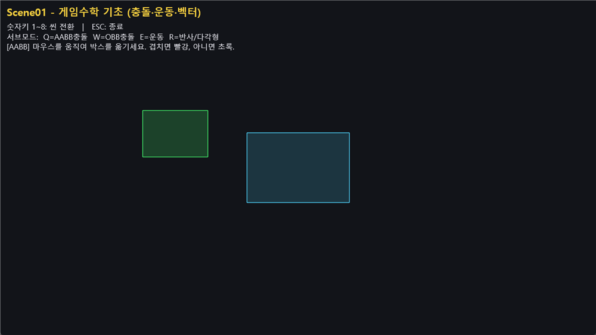<br/>
      <sub><b>Q</b> · AABB 충돌 — 겹치면 빨강, 아니면 초록</sub>
    </td>
    <td align="center" width="50%">
      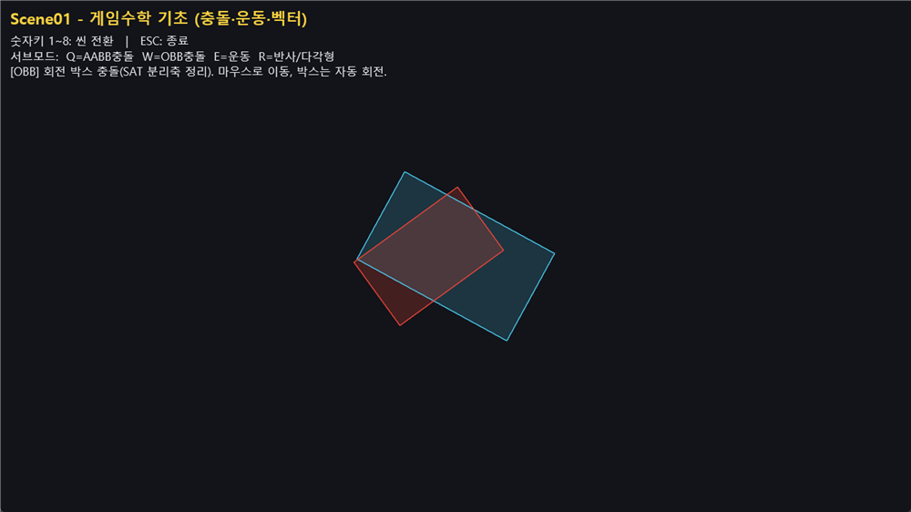<br/>
      <sub><b>W</b> · OBB 충돌 — SAT(분리축 정리), 회전 박스</sub>
    </td>
  </tr>
  <tr>
    <td align="center" width="50%">
      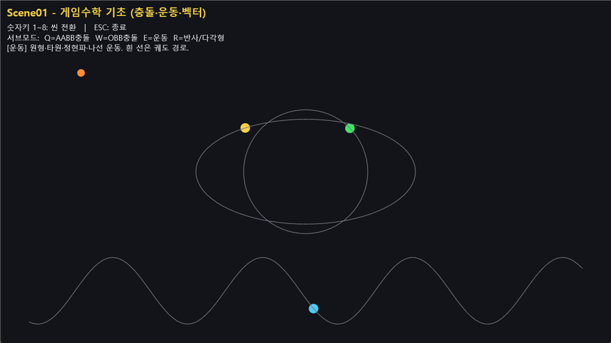<br/>
      <sub><b>E</b> · 운동 — 원형·타원·정현파·나선 + 궤도 경로</sub>
    </td>
    <td align="center" width="50%">
      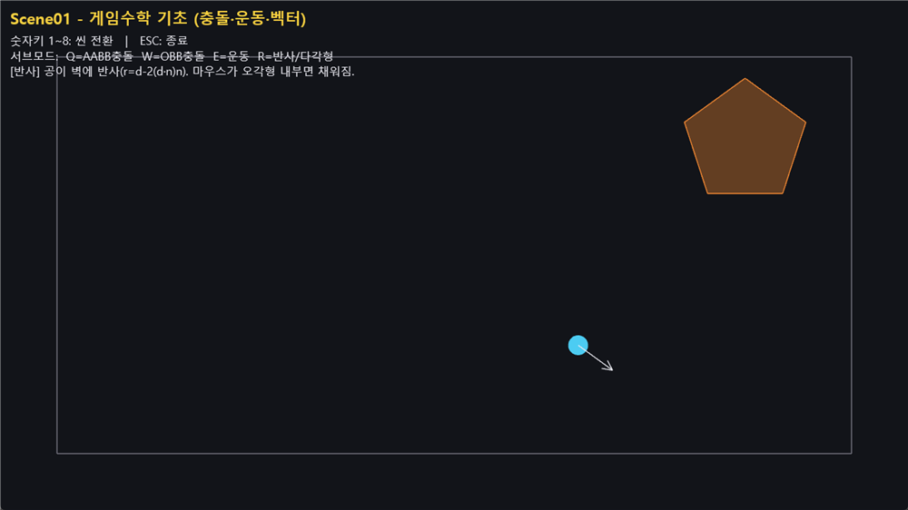<br/>
      <sub><b>R</b> · 반사 — 벽 반사 벡터 + 볼록 다각형 내부 판별</sub>
    </td>
  </tr>
</table>

---

## Scene02 — 보간과 곡선

게임에서 애니메이션·경로에 쓰이는 보간과 파라메트릭 곡선을 2D로 보여줍니다. 주황 제어점을 **마우스로 드래그**해 곡선을 바꿀 수 있습니다.

| 서브모드 | 내용 |
|----------|------|
| `Q` 보간 비교 | Linear / Smoothstep / Sine / SineInOut 이징을 동시에 — 이동 + `t→값` 그래프 |
| `W` Bezier | 3차 Bezier + 제어 다각형 + **de Casteljau** 구성 시각화 |
| `E` Hermite | 끝점·접선 핸들로 곡선 방향 제어 |
| `R` Catmull-Rom | 제어점을 모두 지나는 닫힌 스플라인 + **arc-length 등속** 이동 |

곡선 수식은 [`src/Math/Curves.h`](src/Math/Curves.h)에 순수 함수로 있습니다.

<table>
  <tr>
    <td align="center" width="50%">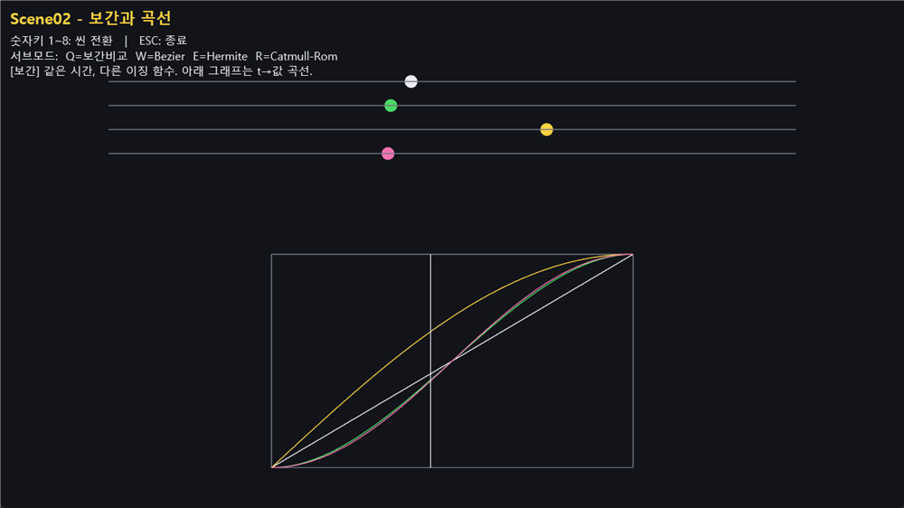<br/><sub><b>Q</b> · 보간 비교 + 그래프</sub></td>
    <td align="center" width="50%">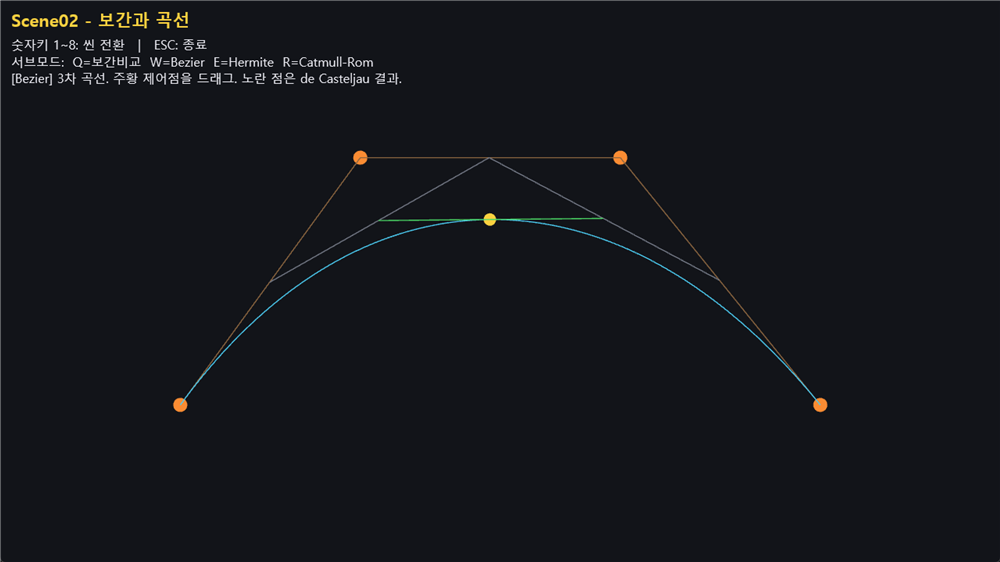<br/><sub><b>W</b> · 3차 Bezier (de Casteljau)</sub></td>
  </tr>
  <tr>
    <td align="center" width="50%">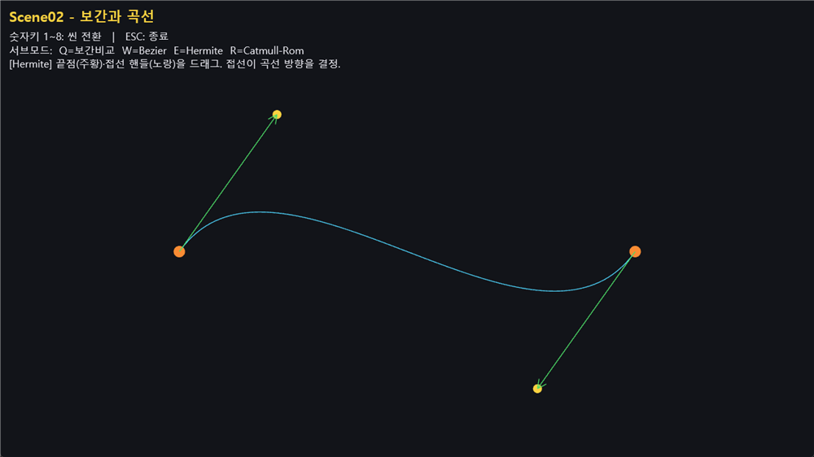<br/><sub><b>E</b> · Hermite (접선 핸들)</sub></td>
    <td align="center" width="50%">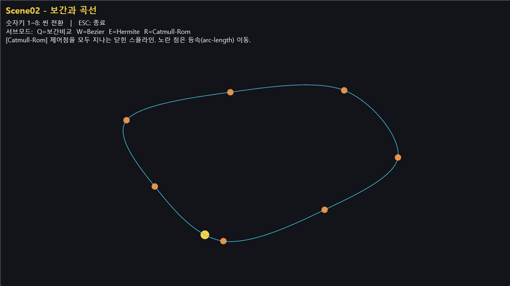<br/><sub><b>R</b> · Catmull-Rom 닫힌 스플라인</sub></td>
  </tr>
</table>

---

## Scene03 — 행렬 변환과 투영

3D 파이프라인의 좌표 변환을 직접 보여줍니다. 마우스 좌드래그로 카메라 공전.

| 서브모드 | 내용 |
|----------|------|
| `Q` TRS 분해 | `world = S * R * T`. 방향키 이동 / `[` `]` 스케일 / 회전 자동, 결과 행렬을 실시간 텍스트로 표시 |
| `W` 투영 비교 | 좌우 분할 — 왼쪽 **정사영**(크기 일정), 오른쪽 **원근**(멀수록 작아짐). `F`/`V` 로 FOV 조절 |
| `E` LookAt 전개 | `XMMatrixLookAtLH` 대신 **외적으로 View 행렬을 직접 구성**. X·Y·Z 축 표시 |

3D 라인·도형은 재사용 가능한 [`src/Render/PrimitiveBatch3D`](src/Render/PrimitiveBatch3D.h)(viewProj 기반, 깊이 테스트)로 그립니다.

<table>
  <tr>
    <td align="center" width="33%">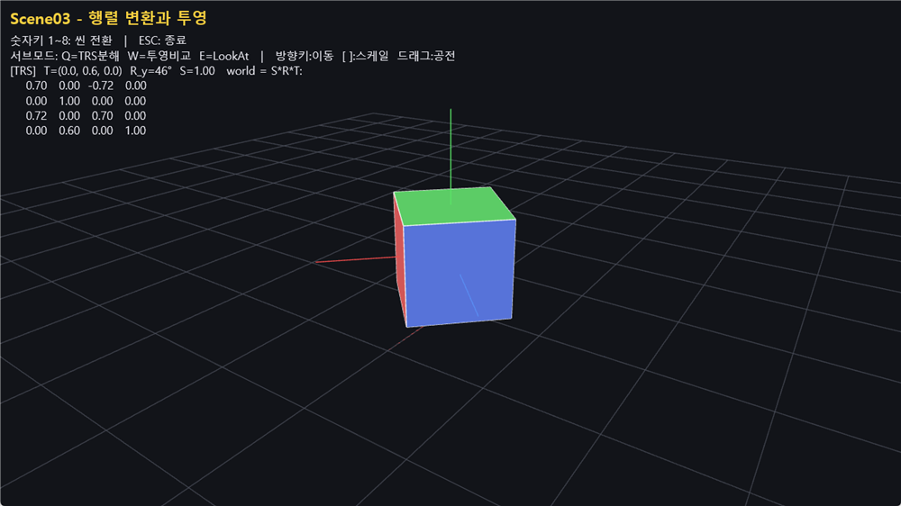<br/><sub><b>Q</b> · TRS 분해 (S·R·T + 행렬값)</sub></td>
    <td align="center" width="33%">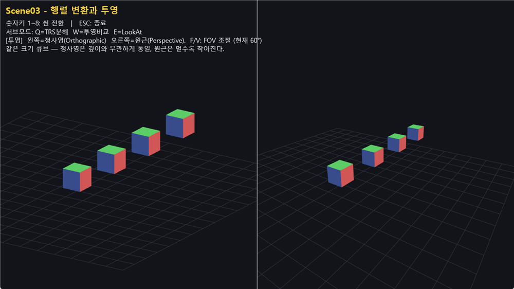<br/><sub><b>W</b> · 정사영 vs 원근</sub></td>
    <td align="center" width="33%">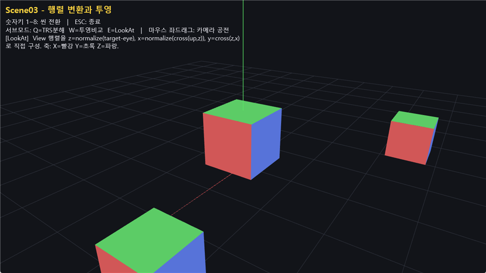<br/><sub><b>E</b> · LookAt 직접 전개</sub></td>
  </tr>
</table>

---

## Scene04 — Phong 조명 + Normal Mapping

이후 3D 씬의 베이스가 되는 조명 셰이더. 구체와 바닥에 점광원(자동 공전)을 비추고, 서브모드로 **조명 항을 하나씩 누적**해 각 항의 효과를 분리해 보여줍니다. 마우스 좌드래그로 카메라 공전, 휠로 줌.

| 서브모드 | 내용 |
|----------|------|
| `Q` Diffuse | 람베르트 난반사만 |
| `W` +Specular | 정반사 하이라이트 추가 (Phong) |
| `E` +Ambient | 주변광 추가 |
| `R` 전체 Phong | + Emissive |
| `T` Normal Mapping | 절차적 벽돌 디퓨즈/노말맵으로 표면 요철 표현 |

법선·탄젠트 계산과 TBN 변환은 [`src/Scene/Scene04_PhongAndNormalMap.cpp`](src/Scene/Scene04_PhongAndNormalMap.cpp)의 임베드 HLSL에, 메시/카메라/절차 텍스처는 [`src/Render/`](src/Render)에 있습니다. 벽돌 텍스처는 **코드로 생성**되어 외부 애셋이 필요 없습니다.

<table>
  <tr>
    <td align="center">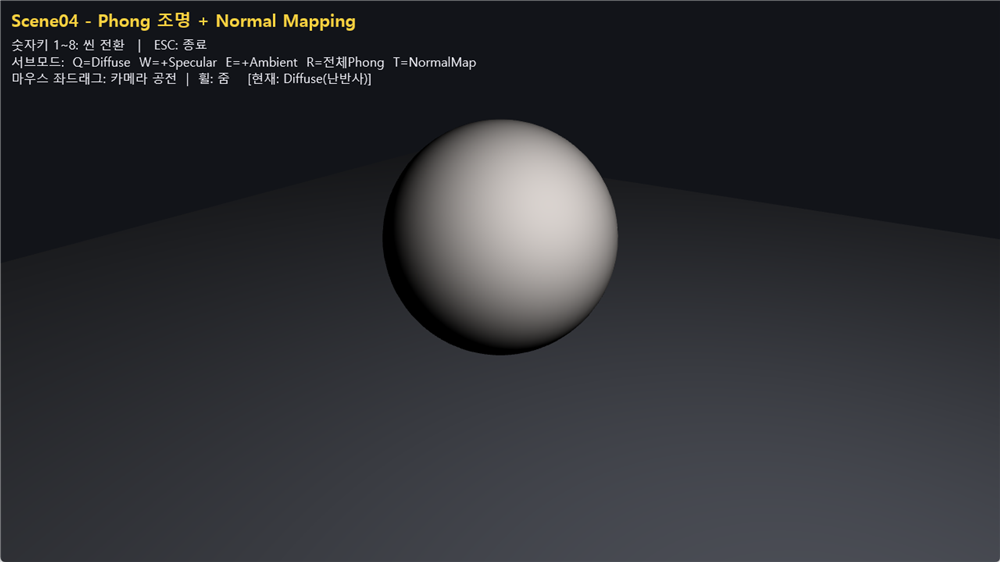<br/><sub><b>Q</b> · Diffuse</sub></td>
    <td align="center">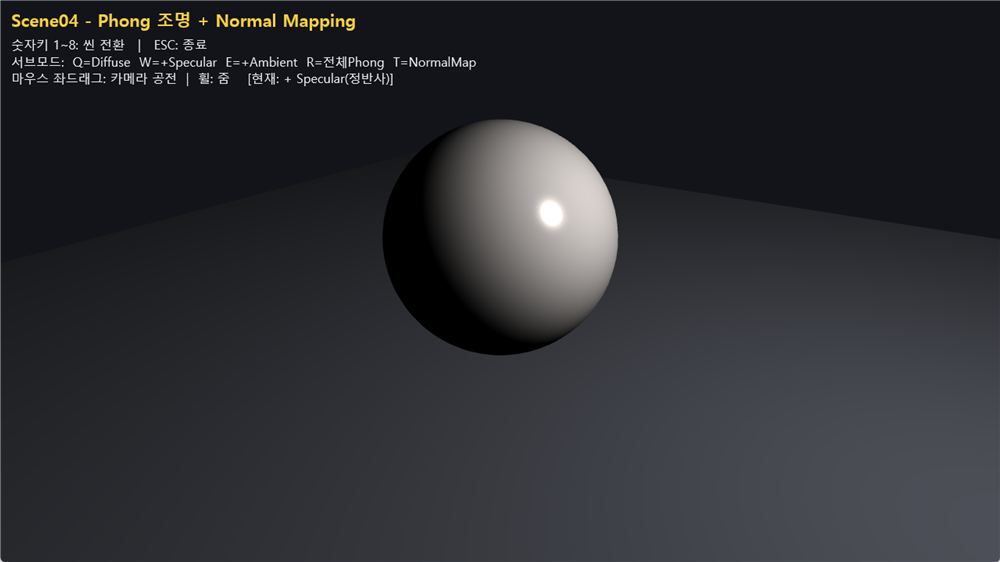<br/><sub><b>W</b> · +Specular</sub></td>
    <td align="center">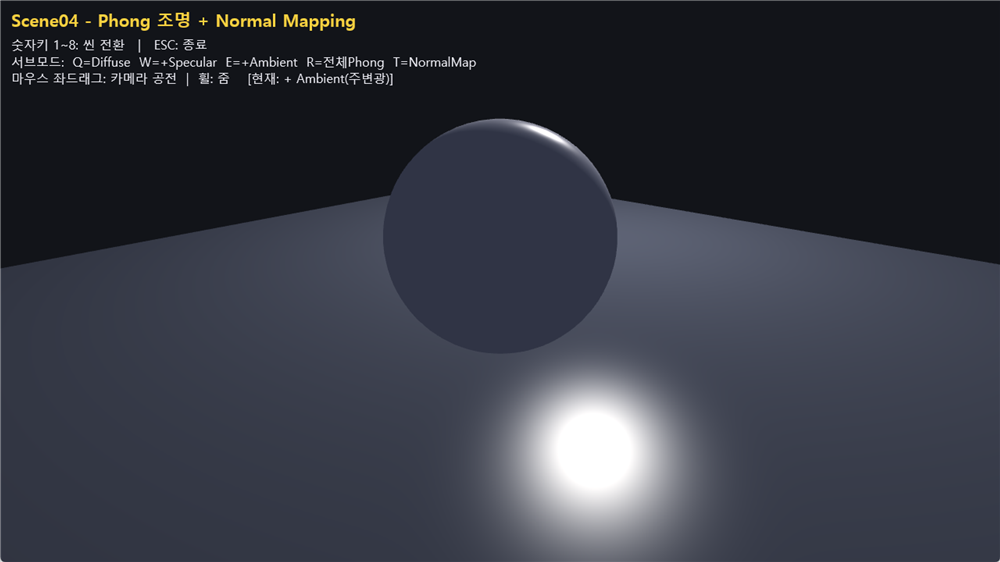<br/><sub><b>E</b> · +Ambient</sub></td>
    <td align="center">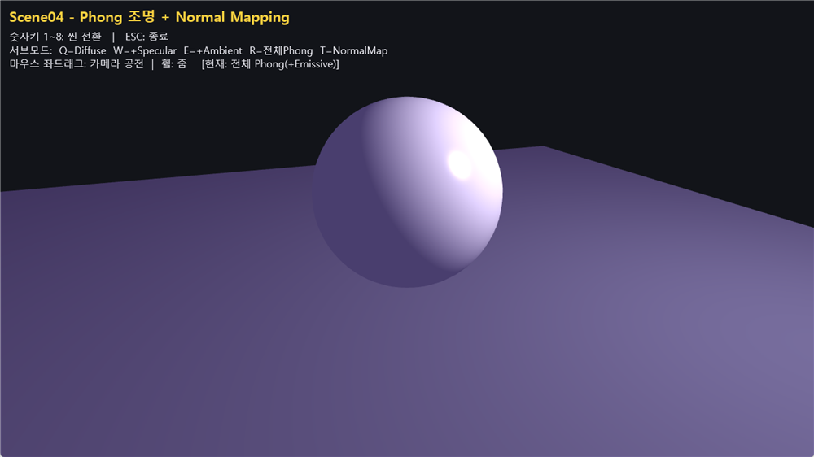<br/><sub><b>R</b> · 전체 Phong</sub></td>
  </tr>
  <tr>
    <td colspan="4" align="center">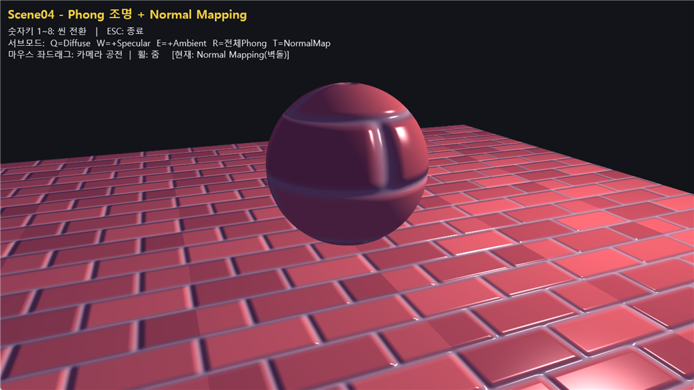<br/><sub><b>T</b> · Normal Mapping — 절차적 벽돌 디퓨즈/노말맵</sub></td>
  </tr>
</table>

---

## 아키텍처

```
src/
├── Main.cpp                         진입점 (WinMain)
├── DemoApp.{h,cpp}                  D3DApp 상속: 씬 매니저 + D2D 텍스트 오버레이
├── IScene.h                         씬 공통 인터페이스 + SceneContext(입력/리소스 전달)
├── PrimitiveBatch2D.{h,cpp}         2D 라인/도형 즉시모드 배처 (런타임 셰이더 컴파일)
├── Scene/
│   ├── Scene01_MathFundamentals.{h,cpp}
│   ├── Scene02_CurvesAndSplines.{h,cpp}    보간·Bezier·Hermite·Catmull-Rom
│   ├── Scene03_TransformProjection.{h,cpp} 행렬·투영·LookAt
│   └── Scene04_PhongAndNormalMap.{h,cpp}   Phong/NormalMap (임베드 HLSL)
├── Math/
│   ├── Collision2D.h                AABB/OBB(SAT)/반사/다각형 내부판별
│   └── Curves.h                     Bezier/Hermite/Catmull-Rom/이징
├── Render/
│   ├── Geometry.h                   구/평면 메시 + 탄젠트
│   ├── OrbitCamera.h                궤도 카메라
│   ├── PrimitiveBatch3D.{h,cpp}     월드공간 3D 라인/도형 배처
│   └── ProceduralTexture.h          벽돌 디퓨즈/노말맵 절차 생성
└── (프레임워크) d3dApp, d3dUtil, DXTrace, CpuTimer, Keyboard, Mouse, WinMin
```

- **씬 시스템**: `IScene`(`Init/Update/Render/Name/HudText`)을 `DemoApp`이 한 번에 하나씩 구동. Scene02~08 추가는 `m_scenes`에 등록만 하면 됩니다.
- **2D 배처**: 픽셀 좌표(좌상단 0,0)를 셰이더에서 NDC로 변환. 라인 리스트·삼각형 리스트를 모아 한 번에 그리며, 셰이더는 `D3DCompile`로 런타임 컴파일(외부 파일 불필요).
- **텍스트**: Direct2D + DirectWrite를 DXGI 표면과 상호운용해 한글 텍스트를 렌더.
- 4x MSAA로 라인/곡선이 매끄럽게 표시됩니다.

---

## 크레딧

- 베이스 프레임워크(`d3dApp`, `Keyboard`, `Mouse`, `DXTrace` 등)는
  [MKXJun/DirectX11-With-Windows-SDK](https://github.com/MKXJun/DirectX11-With-Windows-SDK) (MIT License)를 기반으로 정리했습니다.
- 데모 설계 및 Scene 구현은 본 저장소에서 작성.

## 라이선스

MIT License (`LICENSE` 참고).
